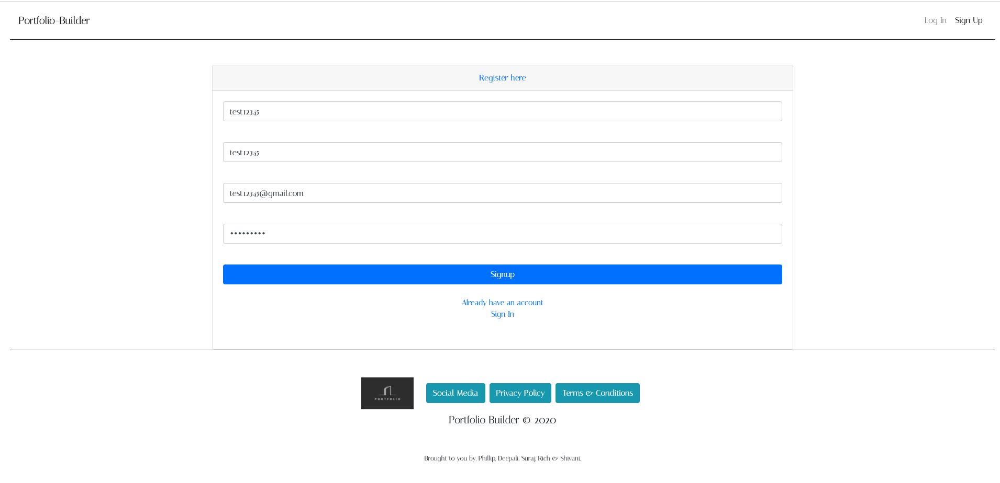
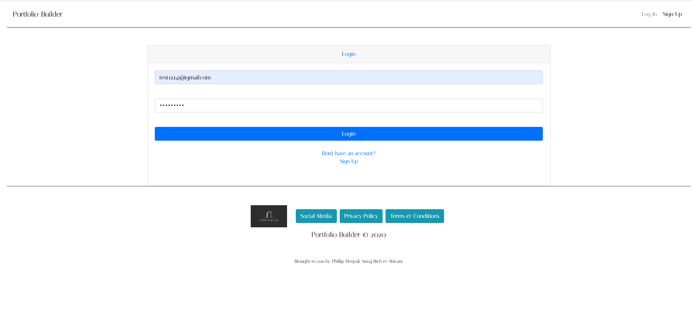
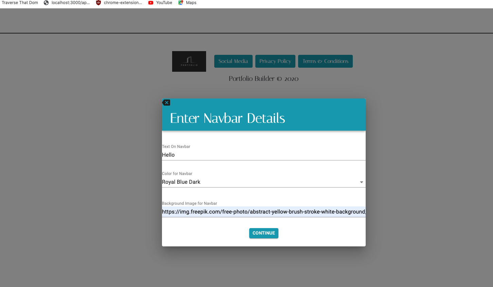
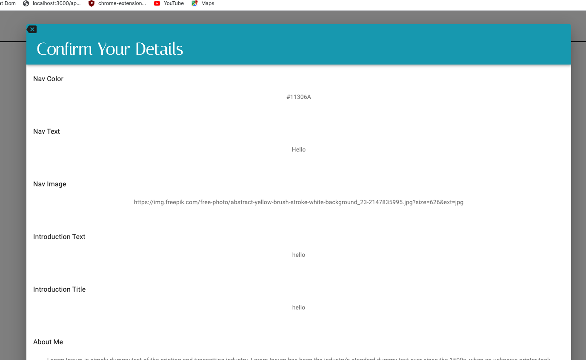

# Portfolio Builder - Project 3

## Project Name: 
Portfolio Builder

## Project Description: 
Portfolio builder is an interactive online portfolio template that allows you to plug in information and build a cohesive portfolio. 

## User Story: 
As a user, I would like to create a portfolio by choosing from an unrivaled set of best-in-class templates and to customize the design to fit my personal style and professional needs.


## Starting the app locally

Start by installing front and backend dependencies. While in this directory, run the following command:

```
npm install
```

This should install node modules within the server and the client folder.

After both installations complete, run the following command in your terminal:

```
npm start
```

Your app should now be running on <http://localhost:3000>. The Express server should intercept any AJAX requests from the client.

## Deployment (Heroku)

To deploy, simply add and commit your changes, and push to Heroku. As is, the NPM scripts should take care of the rest.

## Demostration

### Landing page


### User have to Register if they don't have Account 



### Login Form



### Then User will be greeted by their First Name and Last Name


### User can put their information by clicking on  Template Design or Custom Design and it will direct to wizard.



### At last it ask for Conformation to submit. If there is any mistake user can edit and delte the input.



### After Submitting the Wizard Form it will direct to Template and User can choose their desire Template to Publish.


### Published Template with Full Demo
 
 


## Contributors

```
Richard Capuy
Suraj Gurung
Deepali Jain
Shivani Jha
Phillip Manapat

```
* main repository link (https://github.com/PManapat/Portfolio-Builder )